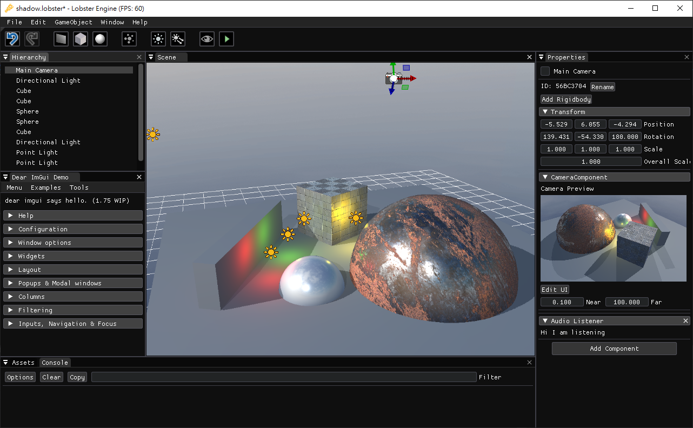

# StealStepFYP
StealStepFYP is a cross-platform ~~偷步~~ game engine for our final year project. Nothing to see here! :smiley:
## Current Progress

Join and follow our roadmap at [](https://trello.com/invite/b/CnX7N13z/665a3ecc44dd00868f37f27c2e5ee895/ssf)

## Engine Architecture
For details, please refer to our [Wiki Page](https://github.com/tkchanat/StealStepFYP/wiki/Engine-Architecture).

## Installation Guide
```diff
- To ensure it builds successfully, run the setup file everytime you perform a git pull
```
### []() Windows: 
1. Make sure you have [Visual Studio 2017+](https://visualstudio.microsoft.com) version to build.
2. Execute `setup.bat` and open project solution `SSF.sln`.
### []() MacOS:
1. Make sure you have [Xcode11+](https://developer.apple.com/xcode/) to build, and [MacOS Catalina+](https://www.apple.com/hk/en/macos/catalina/) to run.
2. Execute `setup.command` and open project workspace `SSF.xcodeproj`.

## Third-party Dependencies
* [glfw](https://github.com/glfw/glfw) - A multi-platform library for OpenGL, OpenGL ES, Vulkan, window and input
* [glm](https://github.com/g-truc/glm.git) - OpenGL Mathematics
* [glad](https://github.com/Dav1dde/glad) - Multi-Language Vulkan/GL/GLES/EGL/GLX/WGL Loader-Generator based on the official specs.
* [imgui](https://github.com/ocornut/imgui) - Dear ImGui: Bloat-free Immediate Mode Graphical User interface for C++ with minimal dependencies
* [imguizmo](https://github.com/CedricGuillemet/ImGuizmo) - Immediate mode 3D gizmo for scene editing and other controls based on Dear Imgui
* [json](https://github.com/nlohmann/json) - JSON for Modern C++
* [spdlog](https://github.com/gabime/spdlog) - Fast C++ logging library.
* [assimp](https://github.com/assimp/assimp) - [Binary distribute] Official Open Asset Import Library Repository. Loads 40+ 3D file formats into one unified and clean data structure.
